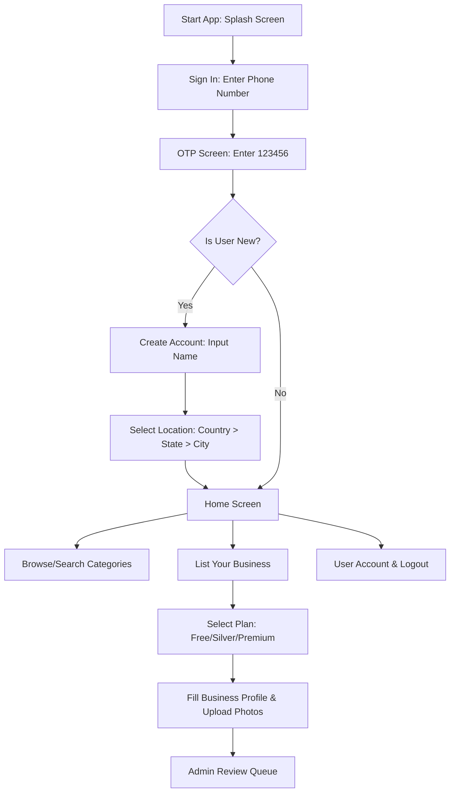

# 📱 Local Trade Street (LTS) — Business CRM & Consumer Companion App

A production-ready hyperlocal companion app built with React Native (Expo) and Node.js (Express/TypeScript) enabling business owners to list their business, view real-time leads (via Socket.IO), manage customer reviews, track analytics, and handle plans, alongside a robust admin dashboard for directory operators.

---

## 🚀 Live Deployments & Build Artifacts

| Resource | Live Link / Status | Description |
| :--- | :--- | :--- |
| **📱 Live Android APK** | [**Download Deployed APK (Expo EAS)**](https://expo.dev/accounts/shivprasad09s-team/projects/lts-customer-app/builds/e802995a-133e-497a-8b1c-b0ccc5b5b51e) | Install directly on any Android device. |
| **🌐 Production API (Render)** | [`https://lts-customer-app.onrender.com`](https://lts-customer-app.onrender.com) | Live Express & Socket.IO server backend. |
| **🟢 Server Health Check** | [`https://lts-customer-app.onrender.com/health`](https://lts-customer-app.onrender.com/health) | Live backend status monitor. |
| **🗄️ Database** | **MongoDB Atlas Cloud Database** | High-availability cluster storing users, businesses, reviews, and enquiries. |

---

## 🔑 Demo Testing Credentials

For testing and verification purposes, a **Demo OTP Master Bypass** is enabled:

* **Phone Number:** Enter **any** 10-digit number (e.g., `8956657409` or `9999999999`).
* **One-Time Password (OTP):** Use **`123456`**.
* No external SMS gateway charges are incurred during testing.

---

## 🗺️ User Onboarding & Application Workflow



### 1. New User Sign Up & Location Selection
1. **Splash Screen:** Displays the premium LTS logo and redirects to login.
2. **Sign In:** Enter a 10-digit mobile number.
3. **OTP Verification:** Verification screen auto-filled/validated with `123456`.
4. **Create Account:** Provide display name (stored in MongoDB).
5. **Location Picker:** Onboard state by selecting Country $\rightarrow$ State $\rightarrow$ City.
6. **Home Feed:** Access categories, curated listings, search bars, and banners.

### 2. Business Listing & Plans
* Business owners choose a subscription package (**Free / Silver / Premium**).
* Enter business name, category, upload storefront/service photos, and submit for verification.

### 3. Customer Enquiries & Real-Time Notification
* Consumers submit enquiries from any public business listing.
* Enquiries are instantly pushed to the business owner's device in real-time via **Socket.IO** room channels.

### 4. Review & Owner Reply System
* Customers write star-rated reviews with text comments.
* Business owners receive notifications, can reply to reviews (one reply limit per review), or flag inappropriate feedback for admin moderation.

### 5. Admin Panel & Moderation
* Verification queue for pending business approvals.
* Resolution workflow to resolve or dismiss flagged customer reviews.
* Live platform-wide analytics and statistics dashboard.

---

## 🛠️ Technology Stack & Project Structure

The project is designed as a modular monorepo:

```
lts-app/
├── backend/          # Express + TypeScript + Mongoose (Node 24.x)
└── mobile/           # React Native + Expo (v57.x) + Redux Toolkit
```

### Backend
* **Runtime & Framework:** Node.js, Express, TypeScript, ts-node-dev.
* **Database:** MongoDB Atlas with Mongoose schemas.
* **Real-time Event Engine:** Socket.IO for push alerts.
* **Security & Auth:** JSON Web Tokens (Access + Refresh tokens with bcrypt hashing), Helmet, CORS.
* **Build Configuration:** Custom optimized `tsconfig.json` compatible with Render/Production Node modules.

### Mobile Client
* **Framework:** React Native (Expo SDK 57).
* **Navigation:** React Navigation (Native Stack + Bottom Tabs).
* **State Management:** Redux Toolkit (auth slices, API client integration).
* **Network Requests:** Axios with automatic token refresh interceptor.
* **UX Optimizations:** Global Pull-to-Refresh (`RefreshControl`) on dashboard feeds, clean skeletons, and loading transitions.

---

## ⚙️ Development Setup

### Backend Setup
```bash
cd backend
npm install
cp .env.example .env    # Configure MONGO_URI, secrets, MSG91
npm run seed            # Seeds test categories & users
npm run dev             # Starts API server on port 4000
```

### Mobile Client Setup
```bash
cd mobile
npm install
npx expo start          # Scan QR code with Expo Go app on your phone
```

---

## 🚂 Render Production Deploy Guide

1. Create a **Web Service** on Render connected to this repository.
2. Set the **Root Directory** to `backend`.
3. Set the **Build Command** to `npm install && npm run build`.
4. Set the **Start Command** to `node dist/server.js`.
5. Add the environment variables from `.env.example` (especially `MONGO_URI`, `JWT_ACCESS_SECRET`, and `JWT_REFRESH_SECRET`).
